# the most used tools

**I used this in google colab (you can use any notebook like Jupyter)**

here is a [link](https://colab.research.google.com/drive/14LWYxnn5gsSD0gtKprjXQS-hJwJi0PA7?usp=sharing) for my notebok in colabc

I used some AI to do it

***all this nubers are not real***


## Bar chart `px.bar`.

```python 
import plotly.express as px 

# 1. Define the data points
categories = ['Model A', 'Model B', 'Model C']
accuracy = [85, 92, 78]

# 2. Create the bar chart
fig = px.bar(x=categories, y=accuracy, title='AI Model Accuracy Comparison')

# 3. Open the graph in your browser
fig.show()
```

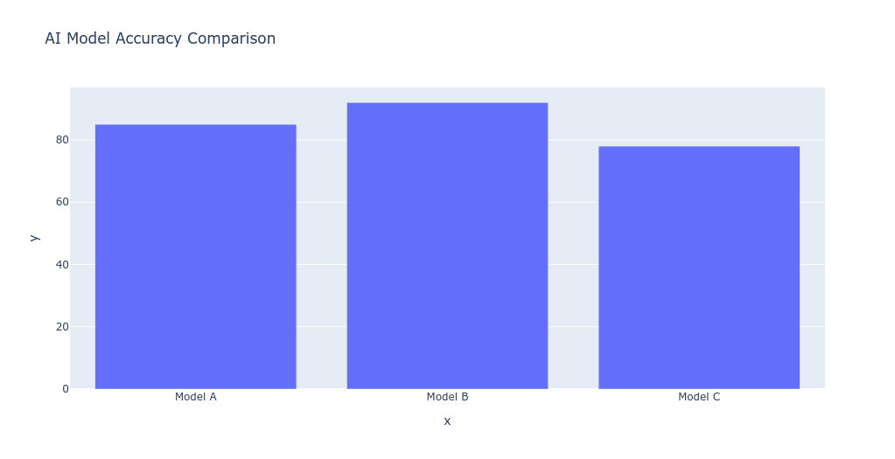

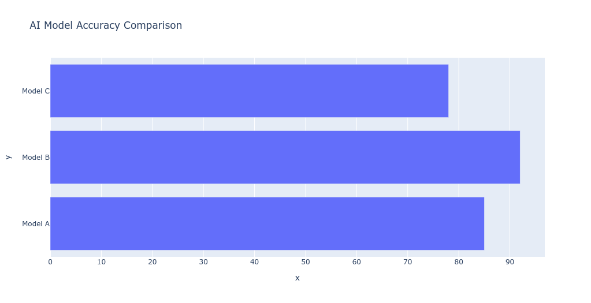

---

## Line chart `px.line`

```python
import plotly.express as px 

# 1. Define the data points
epochs = [1, 2, 3, 4, 5]
loss = [0.8, 0.5, 0.3, 0.2, 0.1]

# 2. Create the line chart
fig = px.line(x=epochs, y=loss, title='AI Model Training Loss')

# 3. Open the graph in your browser
fig.show()
```

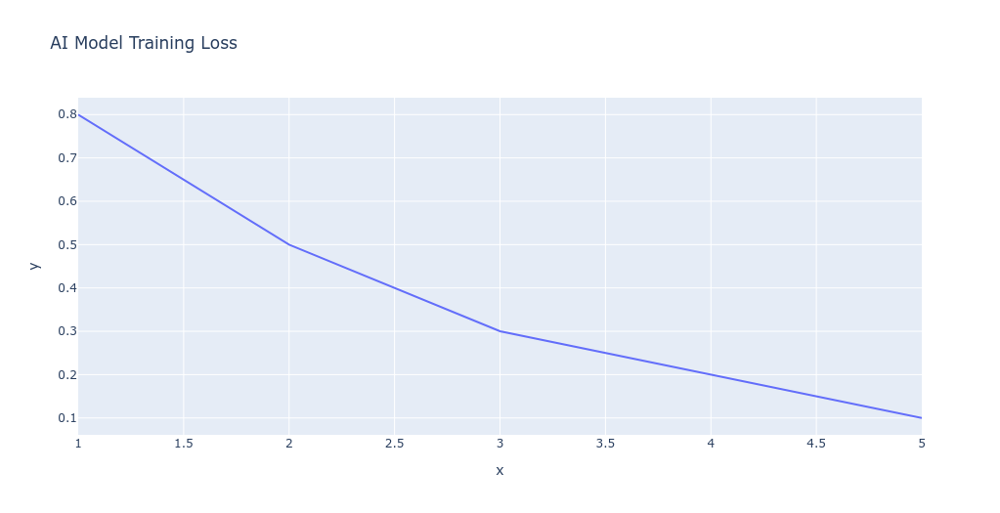

---

## scatter plot `px.scatter`

```python
import plotly.express as px 

# 1. Define the data points
model_size_mb = [10, 50, 100, 200, 500]
inference_time_ms = [5, 12, 25, 60, 150]

# 2. Create the scatter plot
fig = px.scatter(x=model_size_mb, y=inference_time_ms, title='Model Size vs. Speed')

# 3. Open the graph in your browser
fig.show()
```

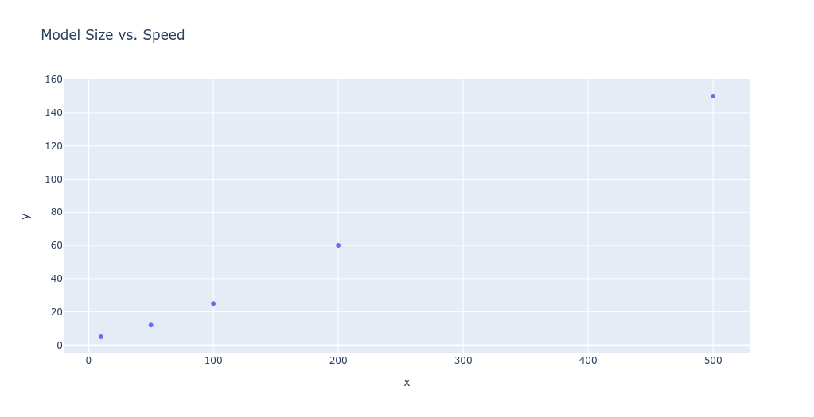

---

## Pie Chart `px.pie`

```python
import plotly.express as px 

# 1. Define the data points
labels = ['Training Data', 'Validation Data', 'Testing Data']
values = [70, 15, 15]

# 2. Create the pie chart
fig = px.pie(names=labels, values=values, title='Dataset Split Proportions')

# 3. Open the graph in your browser
fig.show()
```

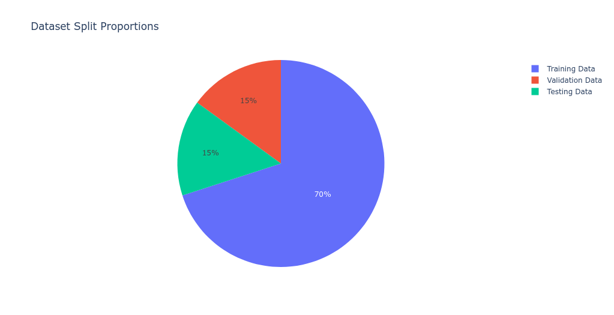

---

## Histogram `px.histogram`

```python
import plotly.express as px 

# 1. Define the data points (a list of raw numbers)
pixel_intensities = [12, 15, 15, 17, 20, 21, 22, 50, 55, 60, 61, 65, 90]

# 2. Create the histogram
fig = px.histogram(x=pixel_intensities, title='Image Pixel Intensity Distribution')

# 3. Open the graph in your browser
fig.show()
```

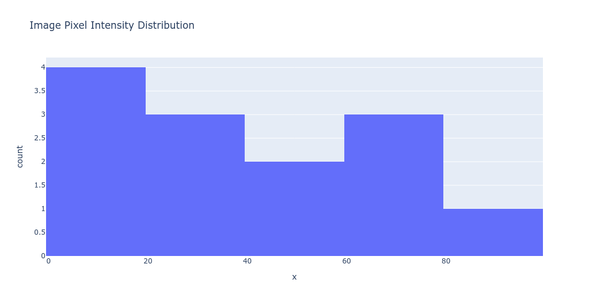

---

## Box Plot `px.box`

```python
import plotly.express as px 

# 1. Define the data points
groups = ['Dataset A', 'Dataset A', 'Dataset B', 'Dataset B', 'Dataset B']
scores = [88, 92, 45, 50, 55] # Dataset B has much lower scores

# 2. Create the box plot
fig = px.box(x=groups, y=scores, title='Data Distribution & Outlier Detection')

# 3. Open the graph in your browser
fig.show()
```

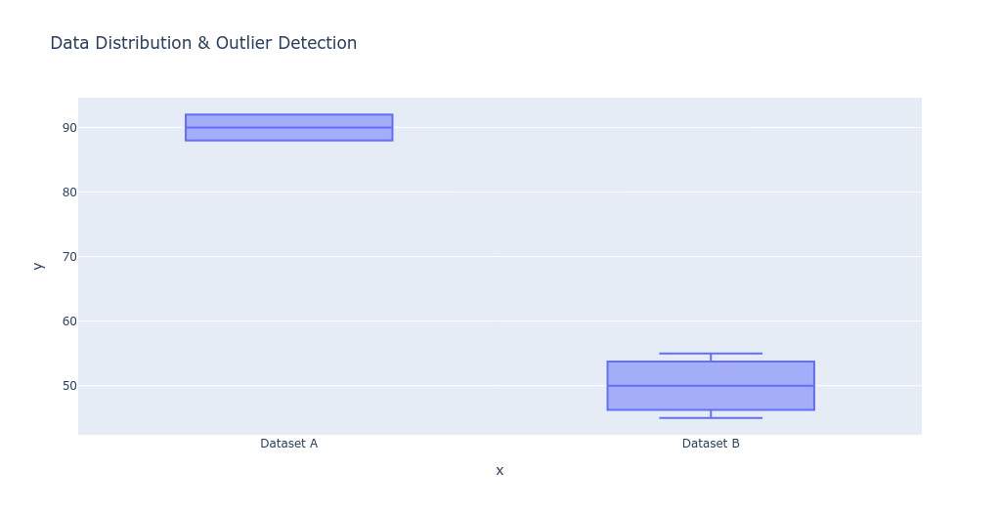

---

## Heatmap `px.imshow`

```python
import plotly.express as px 

# 1. Define the data points (a 4x4 grid/matrix)
matrix = [
    [45, 3, 1, 1],  # Actual Cats
    [2, 40, 5, 3],  # Actual Dogs
    [1,  4, 42, 3], # Actual Birds
    [0,  2,  1, 47] # Actual Rabbits
]
classes = ['Cat', 'Dog', 'Bird', 'Rabbit']

# 2. Create the heatmap
fig = px.imshow(
    matrix, 
    x=classes, 
    y=classes, 
    text_auto=True, 
    title='4x4 AI Confusion Matrix'
)

# 3. Open the graph in your browser
fig.show()
```

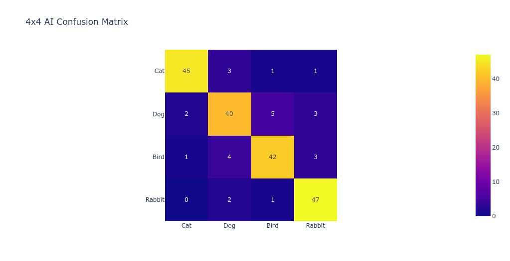

---

## Area chart `px.area`

```python
import plotly.express as px 

# 1. Define the data points
time_steps = [1, 2, 3, 4, 5]
memory_usage_gb = [2.1, 3.4, 4.8, 5.2, 7.1]

# 2. Create the area chart
fig = px.area(x=time_steps, y=memory_usage_gb, title='GPU Memory Usage Over Time')

# 3. Open the graph in your browser
fig.show()
```
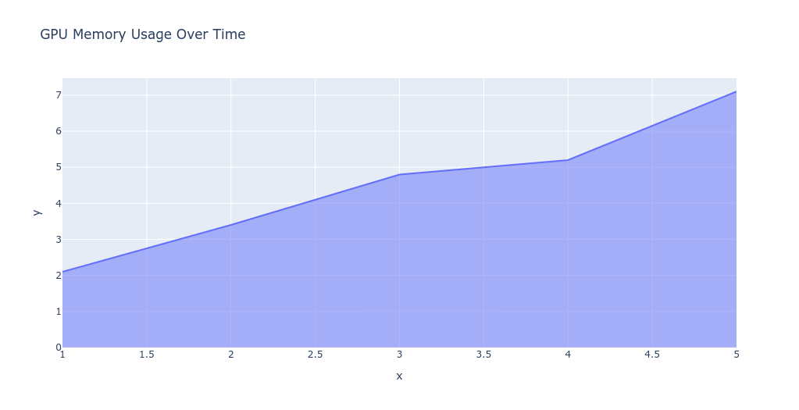

---

## Bubble chart `px.scatter`

this one is the same as the scatter chart but with a new input

```python
import plotly.express as px 

# 1. Define the data points (X, Y, and Size variables)
x_income = [30, 40, 60, 80, 100]
y_savings = [5, 8, 15, 25, 40]
bubble_sizes = [10, 20, 30, 40, 50] # The 3rd dimension

# 2. Create the bubble chart
fig = px.scatter(x=x_income, y=y_savings, size=bubble_sizes, title='Income vs Savings (Size = Age)')

# 3. Open the graph in your browser
fig.show()
```

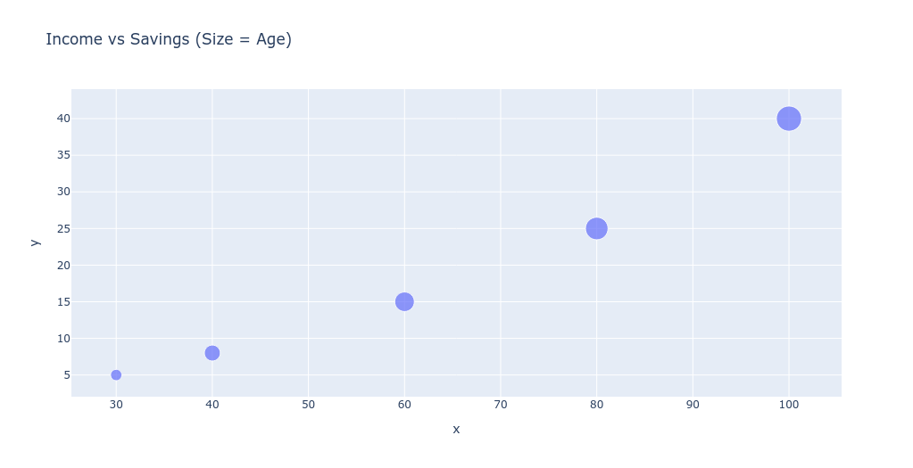

---

## Treemap `px.treemap`

i know it dosn't look like a tree that's what the functin called

```python
import plotly.express as px 

# 1. Define the data points (Hierarchical relationships)
labels = ["AI", "Computer Vision", "NLP", "Classification", "LLMs"]
parents = ["", "AI", "AI", "Computer Vision", "NLP"]
values = [0, 40, 60, 40, 60] # Determines sizes of the boxes

# 2. Create the treemap
fig = px.treemap(names=labels, parents=parents, values=values, title='AI Field Hierarchy Breakdown')

# 3. Open the graph in your browser
fig.show()
```

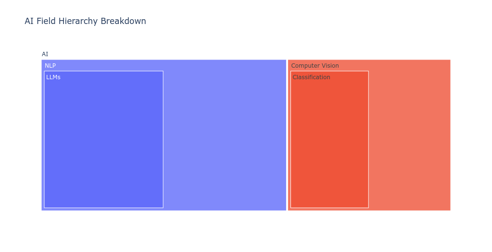


